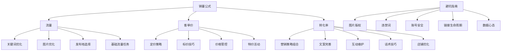

# 闲鱼店群运营概览

闲鱼店群运营概览是基于《闲鱼店群运营细则：从流量获取到转化提升的全流程指南》提炼的系统化运营框架，以 **销量 = 流量 × 客单价 × 转化率** 为核心主线，将运营活动划分为三大模块和一个辅助模块（避坑指南）。

## 框架结构

## 核心方法论

- **APDC循环**（制定→执行→测试→优化）：所有策略迭代都应遵循该循环
- **数据驱动**：利用 生意参谋、飞书系统 等工具辅助决策
- **垂直深耕**：店铺类目保持垂直，避免标签混乱

## 与现有知识的关系

本框架是对现有 闲鱼业务操作全流程 的策略层补充，提供了更上层的思考框架。销量底层公式 在此被确立为运营总纲，所有动作围绕其展开。同时引入了 商品发布地选择策略、概念营销与实物营销、APDC循环 等新概念。

## 核心结论

- 闲鱼店群运营概览是基于《闲鱼店群运营细则：从流量获取到转化提升的全流程指南》提炼的系统化运营框架，以 **销量 = 流量 × 客单价 × 转化率** 为核心主线，将运营活动划分为三大模块和一个辅助模块（避坑指南）。
- **APDC循环**（制定→执行→测试→优化）：所有策略迭代都应遵循该循环
- **数据驱动**：利用 生意参谋、飞书系统 等工具辅助决策

## 质疑问题

- 闲鱼店群运营概览 的前提假设是什么？是否总是成立？
- 在 闲鱼 领域，闲鱼店群运营概览 的边界条件是什么？有没有反例？
- 如何验证 闲鱼店群运营概览 的有效性？数据/结论的来源是什么？

## 适用场景

- 新手卖家入门：理解闲鱼运营的系统性
- 团队管理：建立标准化运营流程
- 策略迭代：以数据为反馈持续优化

该概览作为闲鱼运营知识的整合节点，连接了策略层（流量、定价、转化）与执行层（具体操作技巧）。